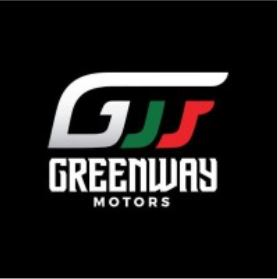

# 🚗 Greenway Motors - Premium Automotive Excellence

**Beyond Borders** - A modern, multilingual automotive dealership platform specializing in exporting premium vehicles from Japan and the UAE to markets across Africa.



## 🌟 Features

### 🚙 Vehicle Management

- **Comprehensive Inventory**: Browse premium vehicles with detailed specifications
- **Advanced Filtering**: Filter by brand, type, drive type (RHD/LHD), fuel type, and more
- **Real-time Search**: Dynamic search functionality with instant results
- **Sold Out Status**: Clear indication of vehicle availability
- **FOB/CIF Pricing**: Transparent pricing with FOB and CIF options

### 🌍 Multilingual Support

- **English** 🇺🇸
- **Arabic** 🇸🇦 (RTL support)
- **Swahili** 🇹🇿

### 📱 Modern UI/UX

- **Responsive Design**: Optimized for all devices
- **Premium Typography**: Ubuntu & Exo 2 fonts from Google Fonts
- **Smooth Animations**: Enhanced user experience with Tailwind CSS
- **Dark/Light Themes**: Professional automotive styling

### 🔧 Technical Features

- **MongoDB Integration**: Robust database connectivity
- **WhatsApp Integration**: Direct price quote requests
- **Google Maps**: Embedded showroom location
- **Performance Optimized**: Lazy loading, code splitting, and caching
- **SEO Friendly**: Meta tags and structured data

## 🛠️ Tech Stack

### Frontend

- **React 18** with TypeScript
- **Vite** for fast development and building
- **Tailwind CSS** for styling
- **Shadcn/ui** for UI components
- **React Router** for navigation
- **Lucide React** for icons

### Backend

- **Node.js** with Express
- **MongoDB** with Mongoose
- **TypeScript** for type safety
- **CORS** enabled for cross-origin requests

### Development Tools

- **ESLint** for code linting
- **PostCSS** for CSS processing
- **tsx** for running TypeScript files

## 🚀 Getting Started

### Prerequisites

- Node.js (v18 or higher)
- MongoDB (running on port 27017)
- npm or yarn package manager

### Installation

1. **Clone the repository**

   ```bash
   git clone https://github.com/yourusername/greenway-motors.git
   cd greenway-motors
   ```

2. **Install dependencies**

   ```bash
   npm install
   ```

3. **Set up MongoDB**

   - Ensure MongoDB is running on `mongodb://localhost:27017`
   - Database name: `greenway`

4. **Seed the database** (optional)

   ```bash
   npm run seed
   ```

5. **Start the development servers**

   **Frontend:**

   ```bash
   npm run dev
   ```

   **Backend:**

   ```bash
   npm run server
   ```

6. **Open your browser**
   - Frontend: `http://localhost:5173`
   - Backend API: `http://localhost:5000`

## 📁 Project Structure

```
greenway-motors/
├── public/                 # Static assets
├── src/
│   ├── assets/            # Images and media files
│   │   └── Cars/          # Vehicle images
│   ├── components/        # Reusable UI components
│   │   ├── home/          # Home page components
│   │   ├── layout/        # Layout components
│   │   └── ui/            # Shadcn/ui components
│   ├── contexts/          # React contexts
│   │   ├── AuthContext.tsx
│   │   └── LanguageContext.tsx
│   ├── data/              # Static data
│   │   └── cars.ts        # Vehicle data
│   ├── hooks/             # Custom React hooks
│   ├── lib/               # Utility functions
│   ├── pages/             # Page components
│   │   └── services/      # Service pages
│   └── main.tsx           # App entry point
├── server/                # Backend code
│   ├── models/            # Mongoose models
│   ├── routes/            # API routes
│   ├── scripts/           # Database scripts
│   └── server.ts          # Server entry point
└── README.md
```

## 🔌 API Endpoints

### Vehicles

- `GET /api/cars` - Get all vehicles
- `GET /api/cars/:id` - Get specific vehicle
- `POST /api/cars` - Create new vehicle (admin)
- `PUT /api/cars/:id` - Update vehicle (admin)
- `DELETE /api/cars/:id` - Delete vehicle (admin)

### Health Check

- `GET /api/health` - Server health status

## 🌐 Integrations

### WhatsApp Business

- **Direct messaging** for price quotes
- **Pre-filled messages** with vehicle details
- **Phone**: +971 52 482 5533

### Google Maps

- **Embedded map** showing showroom location
- **Direct navigation** links
- **Address**: Ras Al Khor Industrial Area 3, Dubai, UAE

### Social Media

- Facebook: [Greenway Motors](https://www.facebook.com/profile.php?id=61580597323614)
- Instagram: [@greenwaymotors.ae](https://www.instagram.com/greenwaymotors.ae/)
- TikTok: [@greenwaymotors](https://www.tiktok.com/@greenwaymotors)
- LinkedIn: [Greenway Motors FZE](https://www.linkedin.com/company/greenway-motors-fze/)

## 🚗 Vehicle Data Structure

```typescript
interface Car {
  id: string;
  name: string;
  brand: string;
  model: string;
  year: number;
  price: number;
  image: string;
  type: "Sedan" | "SUV" | "Pickup" | "Hatchback" | "Coupe";
  fuelType: "Petrol" | "Diesel" | "Hybrid" | "Electric";
  transmission: "Manual" | "Automatic";
  driveType: "RHD" | "LHD";
  features: string[];
  featured: boolean;
  vehicleCode?: string;
  chasisNumber?: string;
  soldOut?: boolean;
}
```

## 🎨 Styling & Design

### Color Palette

- **Primary**: Emerald Green (`#059669`)
- **Secondary**: Gray scale
- **Accent**: Black/White contrast

### Typography

- **Headings**: Exo 2 (Google Fonts)
- **Body**: Ubuntu (Google Fonts)
- **Weights**: 300, 400, 500, 600, 700, 800, 900

## 📱 Responsive Breakpoints

- **Mobile**: < 640px
- **Tablet**: 640px - 1024px
- **Desktop**: > 1024px
- **Large**: > 1280px

## 🔧 Available Scripts

```bash
# Development
npm run dev          # Start frontend development server
npm run server       # Start backend server
npm run seed         # Seed database with initial data

# Building
npm run build        # Build for production
npm run preview      # Preview production build

# Code Quality
npm run lint         # Run ESLint
npm run type-check   # TypeScript type checking
```

## 🌍 Internationalization (i18n)

The application supports multiple languages with:

- **Language persistence** in localStorage
- **RTL support** for Arabic
- **Dynamic content translation**
- **Fallback to English** for missing translations

## 🔒 Environment Variables

Create a `.env` file in the root directory:

```env
# Database
MONGODB_URI=mongodb://localhost:27017/greenway

# Server
PORT=5000
NODE_ENV=development

# WhatsApp
WHATSAPP_NUMBER=971524825533

# Contact
CONTACT_EMAIL=sales@greenwaymotors.ae
CONTACT_PHONE=+971524825533
```

## 🚀 Deployment

### Frontend (Vercel/Netlify)

1. Build the project: `npm run build`
2. Deploy the `dist` folder
3. Configure environment variables

### Backend (Railway/Heroku)

1. Set up MongoDB Atlas or similar
2. Configure environment variables
3. Deploy with: `npm run server`

## 🤝 Contributing

1. Fork the repository
2. Create a feature branch: `git checkout -b feature/amazing-feature`
3. Commit changes: `git commit -m 'Add amazing feature'`
4. Push to branch: `git push origin feature/amazing-feature`
5. Open a Pull Request

## 📄 License

This project is licensed under the MIT License - see the [LICENSE](LICENSE) file for details.

## 📞 Contact

**Greenway Motors**

- **Website**: [greenwaymotors.ae](https://greenwaymotors.ae)
- **Email**: sales@greenwaymotors.ae
- **Phone**: +971 52 482 5533
- **Address**: Ras Al Khor Industrial Area 3, Ducumz Show Room No 94, Dubai, UAE

## 🙏 Acknowledgments

- **Shadcn/ui** for the beautiful UI components
- **Tailwind CSS** for the utility-first CSS framework
- **Lucide** for the icon library
- **Google Fonts** for typography
- **MongoDB** for database solutions

---

**Built with ❤️ for the automotive industry**

_Greenway Motors - Beyond Borders_
